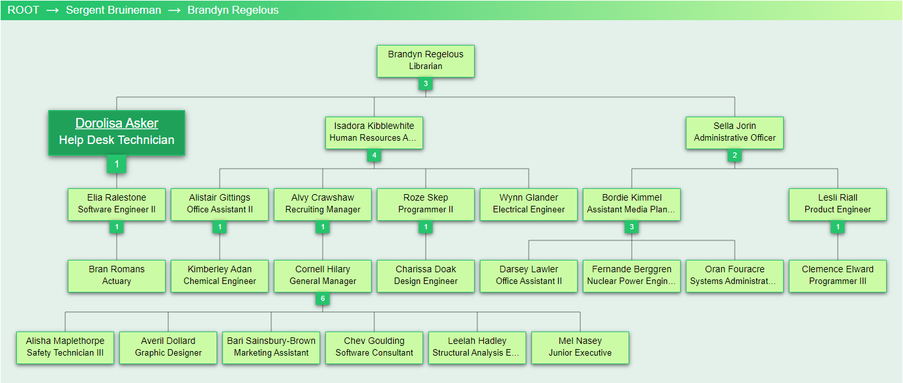

# Org Chart
Compact org chart that uses the Reingold-Tilford tree alogrithm to position nodes (chart items).

Provides breadcrumb navigation, zoom, and node expand + collapse, and "drill-in" functionality via HTML + CSS + TypeScript (strongly typed JavaScript) + RequireJS (for creating modular JavaScript code).

